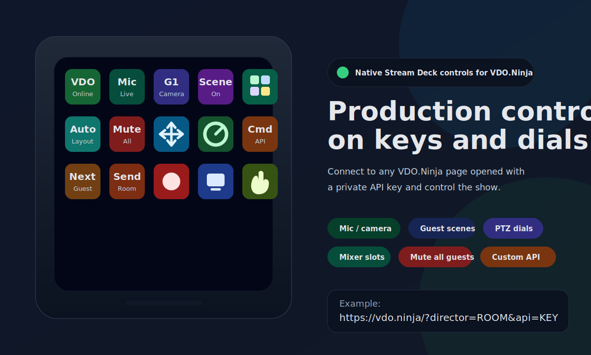
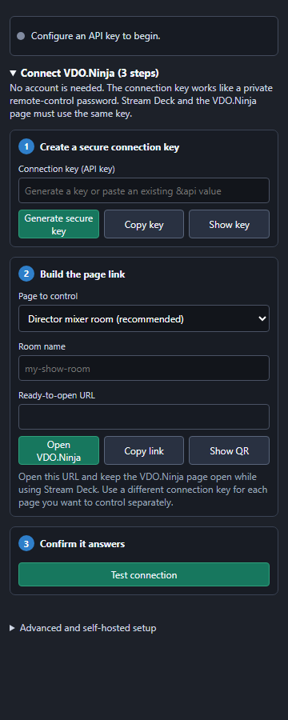

# VDO.Ninja Stream Deck Plugin

[](#status)
[](#requirements)
[](https://docs.elgato.com/streamdeck/sdk/)
[](#requirements)
[](https://vdo.ninja/)
[](#testing)

A native Elgato Stream Deck plugin for controlling VDO.Ninja pages through the existing VDO.Ninja `&api` remote-control system.

The goal is simple: open a VDO.Ninja director, guest, mixer, or camera page with a private API key, then use Stream Deck keys and dials for production controls such as mic/camera toggles, guest targeting, scene membership, mixer layouts, slots, PTZ, volume, bitrate, and custom API commands.

> Status: beta/development. The plugin is usable for testing, but it has not been marketplace-released yet.

## Preview

The key layout is an illustrative production profile. The property-inspector image reflects the current interface; labels may vary with the selected action.





## Highlights

- Native Stream Deck SDK plugin; no Companion dependency required.
- Works with the existing VDO.Ninja API relay using `&api=YOUR_PRIVATE_KEY`.
- Supports both key actions and Stream Deck + dial/encoder actions.
- Includes setup helpers for director, push, view, scene/output, and custom VDO.Ninja URLs.
- Uses live VDO.Ninja state from `getDetails`, partial `details` updates, and guest list ordering.
- Tracks API transport health, including messages per second and WebSocket backlog.
- Rate-limits or skips high-rate no-wait incremental controls when the API socket is overloaded.
- Preserves established VDO.Ninja API shapes, with legacy-safe scene and mute-all behavior.

## Quick Setup

1. In Stream Deck, drag `Connection Status` onto any key.
2. In the panel on the right, click `Generate secure key`, enter your VDO.Ninja room name, then click `Open VDO.Ninja`.
3. Keep that browser tab open and click `Test connection`. A green status means it is ready.
4. Drag the controls you want onto other keys or dials. For guest controls, `guest position` means the G1, G2, and G3 order shown by the VDO.Ninja director; it is not a mixer destination slot.

The setup panel collapses after configuration so each action's settings stay easy to reach. VDO.Ninja requires no account. Treat the generated connection key like a password, and use a different key for every page you want to control separately.

## Supported Actions

| Action | Controls | Feedback |
| --- | --- | --- |
| Connection Status | API key, API host, setup links, QR code, connection test | Connected/no-page/timeout/error state |
| Local Control | Mic, camera, speaker, record, screen share, hand, force keyframe, reload, hangup | On/off state where VDO.Ninja reports it |
| Select Guest | Fixed guest, next, previous, first held, clear selected guest | Selected target state/title |
| Guest Command | Guest mic, camera, speaker, display, volume, group, transfer, activate held guest, hangup, solo modes, chat overlays, refresh/recover/keyframe | Target-aware titles and known guest states |
| Guest Scene | Toggle or force guest into any scene ID/name | Scene membership feedback |
| Mixer Control | Layout selection, assign guest to mixer slot, unset slot, legacy-safe mute/unmute all guests, guarded transfer-all | Mixer key states, slot feedback, all-muted feedback |
| PTZ Key | Local zoom/pan/tilt/focus/exposure; guest zoom/pan/tilt/focus/autofocus | Target-aware PTZ titles |
| PTZ Dial | Stream Deck + relative PTZ control with inversion, acceleration, rate limiting, and press actions | Current control/status title |
| Value Dial | Local volume, panning, bitrate, buffer delay, guest volume | Clamped value feedback |
| Custom Command | Any VDO.Ninja `{ action, target, value, value2 }` payload | OK/alert result feedback |

## VDO.Ninja Version Compatibility

The command registry was checked directly against the last pre-v30.1 source (`v29.4`) and the current `v30.2` source. Existing API names and value semantics are not redefined.

- Local, guest, mixer layout/slot, PTZ, value-dial, and custom controls keep their established command shapes.
- `Guest Scene` uses the legacy `addScene` / `addScene2`–`addScene8` paths. Named-scene force-on/off uses live scene state plus the old toggle command, so it does not require the newer `value2` scene extension.
- `Mute all guests` fans out the long-standing targeted `mic` command and excludes directors and screen-share pseudo-guests; it does not require the newer `muteAllGuests` wrapper.
- `Activate Guest` is the one current-only control. It requires VDO.Ninja v30.2+ because older pages have no native `&api` queue-activation handler. An older page rejects it and the plugin shows an alert without changing any legacy behavior.

Very old builds can only support commands that existed in those builds; the plugin does not emulate missing browser features or PTZ handlers.

## Common Workflows

### Director room control

Use a director URL with a private API key:

```text
https://vdo.ninja/?director=ROOM&api=YOUR_PRIVATE_KEY
```

Then add Stream Deck actions for guest mic/camera control, scene toggles, transfer, and mixer actions.

### Mixer and slot control

For slot workflows, use the mixer app or enable slot mode:

```text
https://vdo.ninja/mixer?director=ROOM&api=YOUR_PRIVATE_KEY
https://vdo.ninja/?director=ROOM&api=YOUR_PRIVATE_KEY&slotmode=1
```

`layout=0` means auto layout. Mixer slot assignment uses user-facing destination slot numbers: `1` is mixer slot 1, and `0` unsets the guest's slot assignment.

### PTZ control

Local PTZ needs the controlled camera page opened with `&ptz` and the browser PTZ permission approved:

```text
https://vdo.ninja/?push=CAMERA_ID&api=YOUR_PRIVATE_KEY&webcam&autostart&ptz
```

Guest PTZ is sent from a director or mixer page, but the guest publisher must be loaded with `&ptz` and grant browser camera-control permission.

## Requirements

- Stream Deck desktop app 6.8 or newer.
- Stream Deck hardware, Stream Deck +, or Stream Deck Mobile.
- A VDO.Ninja page opened with a private `&api=KEY` value.
- Node 20 runtime bundled by Stream Deck for the plugin runtime.
- Node.js 20+ installed locally only if you are building from source.

## Install From Source

```bash
cd plugin
npm install
npm run build
npx @elgato/cli@latest link ninja.vdo.streamdeck.sdPlugin
npx @elgato/cli@latest restart ninja.vdo.streamdeck
```

The generated plugin bundle lives at:

```text
plugin/ninja.vdo.streamdeck.sdPlugin/
```

## Testing

No physical Stream Deck is needed for the basic checks:

```bash
cd plugin
npm test
npm run check
npm run build
npx @elgato/cli@latest validate ninja.vdo.streamdeck.sdPlugin --no-update-check
npx @elgato/cli@latest pack ninja.vdo.streamdeck.sdPlugin --dry-run --no-update-check
```

Current automated coverage includes command payload generation, settings normalization, custom value parsing, session-state handling, selected guest targeting, and VDO API transport behavior.

Interactive testing still requires the Stream Deck desktop app with hardware or Stream Deck Mobile.

## Project Layout

```text
plugin/
  manifest.json                 Stream Deck manifest
  src/                          TypeScript plugin source
  ui/action-settings.html       Property inspector UI
  imgs/                         Plugin and key icons
  scripts/                      Asset and bundle helpers
docs/
  assets/                       README preview images
  *.md                          Design notes, API maps, and implementation audits
```

## Notes For VDO.Ninja Users

- The plugin does not replace VDO.Ninja UI state; it extends the existing API paths.
- Keep API keys private. Anyone with the key can control the matching VDO.Ninja page.
- Commands that require `value2`, such as absolute PTZ or all-stream buffer updates, use the WebSocket payload path so secondary values are preserved.
- See [the compatibility audit](docs/vdo-version-compatibility.md) for the source comparison and fallback details.
- Discrete awaited commands are not skipped. Only high-rate no-wait incremental controls, such as relative PTZ and value dials, may be skipped if the API socket is overloaded.

## More Documentation

- [Plugin technical README](plugin/README.md)
- [Plugin architecture](docs/plugin-architecture.md)
- [VDO API action map](docs/vdo-api-action-map.md)
- [Verified API command reference](docs/verified-api-command-and-callback-reference.md)
- [Runtime comparison audit](docs/runtime-comparison-audit.md)
