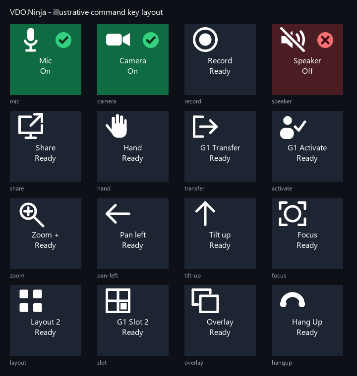
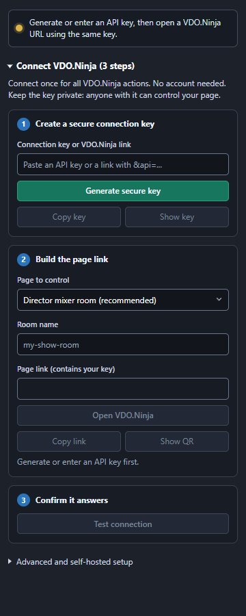

# VDO.Ninja Stream Deck Plugin

Control VDO.Ninja microphones, cameras, guests, scenes, and audio from Stream Deck keys and dials. No VDO.Ninja account or Companion installation needed.

[Download the plugin](https://github.com/steveseguin/vdo-streamdeck/releases/latest) · [Setup guide](docs/getting-started.md) · [Website](https://steveseguin.github.io/vdo-streamdeck/)

The plugin controlling a live director room with two test guests. The keys on the left show exactly what the plugin draws. [Watch the narrated video with sound](https://steveseguin.github.io/vdo-streamdeck/) or [download the MP4](docs/assets/demo.mp4).

## Install and connect

Requires the Stream Deck app **6.8+** on Windows 10+ or macOS 12+, and Stream Deck hardware or Stream Deck Mobile. Dial actions need Stream Deck +. The plugin is in beta and is not yet in the Elgato Marketplace.

1. Download **ninja.vdo.streamdeck.streamDeckPlugin** from the latest release, then double-click it to install.
2. In Stream Deck, drag **Connection Status** onto an empty key.
3. In the panel below the keys, click **Generate secure key**.
4. Leave **Director mixer room** selected, enter your room name, and click **Open VDO.Ninja**.
5. Keep that browser tab open. Click **Test connection**; the panel should say **VDO.Ninja page answered**.
6. Add the controls you need. They share this connection automatically.

All VDO.Ninja actions share **one connection**, across Stream Deck profiles. Changing the key changes the page they control. Already have a page with `api=` in its URL? Paste the full link into **Connection key or VDO.Ninja link**, then test. For a link without an API key, choose **Existing VDO.Ninja URL** and open the generated link.

## Preview

Example key layout using the plugin's command icons. Labels and states depend on your settings and the connected page.

The connection panel:

## Choose an action

| Action | Use it to |
| --- | --- |
| **Connection Status** | Set up the connection and check which page is responding. |
| **Local Control** | Control the connected page's mic, camera, speaker, recording, screen share, and more. Includes hold-to-talk and hold-to-mute. |
| **Select Guest** | Choose a guest for other controls to follow, or move to the next or previous guest. |
| **Guest Command** | Control a guest's mic, camera, volume, group, overlays, or transfer. |
| **Guest Scene** | Add or remove a guest from a scene. |
| **Guests List** | Show connected guests or the guests in one scene on a key. |
| **Mixer Control** | Change layout, assign mixer slots, mute guests, or transfer them. |
| **PTZ Key / PTZ Dial** | Move a supported camera or adjust zoom, focus, and local exposure. |
| **Value Dial** | Adjust volume, audio panning, bitrate, or buffer delay. |
| **Custom Command** | Send an advanced VDO.Ninja API command. |

**Guest position** means G1, G2, and so on in the VDO.Ninja director. A **mixer slot** is where a guest appears in the output. Use a director or mixer page for guest controls.

For PTZ, open the camera page with `&ptz` and approve camera-control permission. **Activate Guest** requires VDO.Ninja v30.2 or newer. For the newest VDO.Ninja features, [connect to alpha](docs/getting-started.md#use-vdoninja-alpha).

## Keep your connection private

The key, generated link, and QR code allow remote control of your page. Do not share them. The key and link stay hidden until you click **Show key**. Use a separate key for each VDO.Ninja page; pages sharing a key receive the same commands.

Settings are saved in Stream Deck. Commands go to the configured VDO.Ninja API relay. No separate plugin account is required.

## More help

- [Setup, guest targeting, dials, and troubleshooting](docs/getting-started.md)
- [Build from source and technical reference](plugin/README.md)
- [API and documentation index](docs/README.md)
