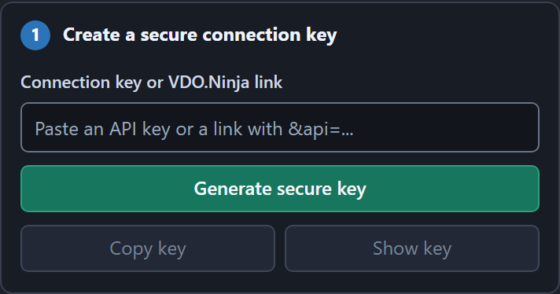
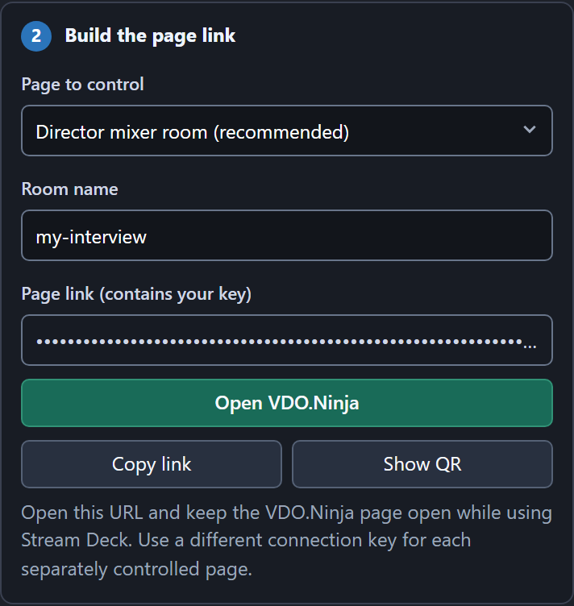
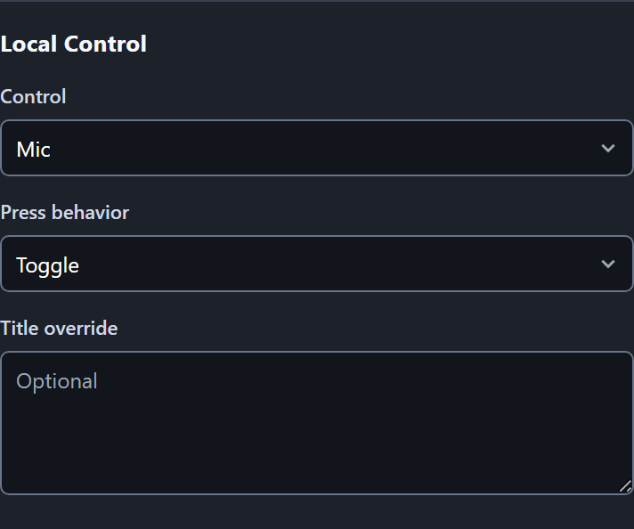
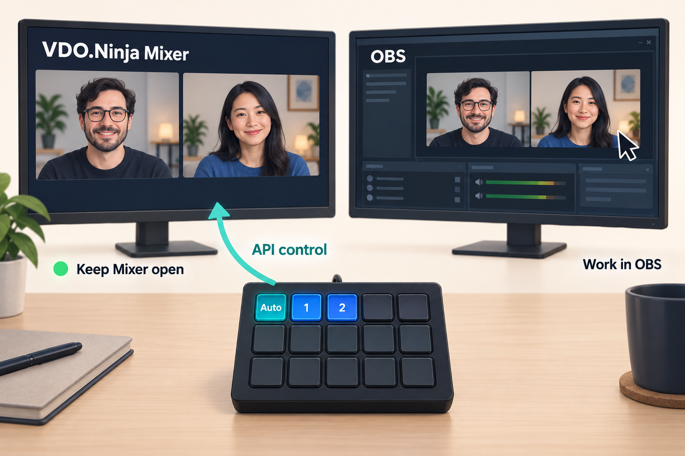
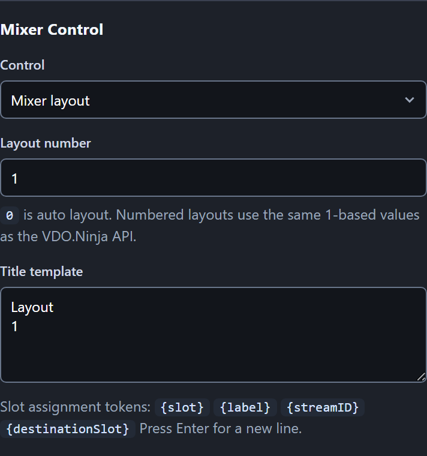
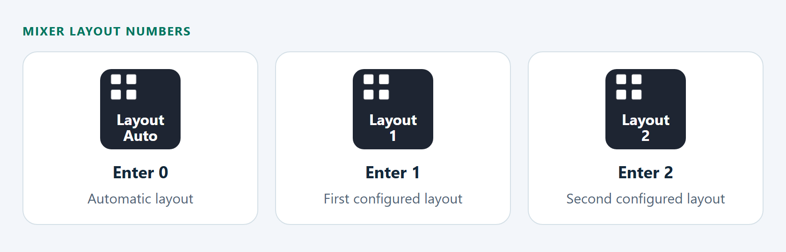

# Set Up VDO.Ninja on Stream Deck

Control your mic, guests, and Mixer layouts from Stream Deck. Keep VDO.Ninja open in your browser; you can work in OBS or another app while pressing the buttons.

**[① Install](#install) → [② Connect](#connect-your-page) → [③ Add a button](#add-controls)**

Already connected? Jump to [Mixer layouts](#mixer-slots-and-layouts), [guest controls](#choose-a-guest), or [troubleshooting](#troubleshooting).

## ① Install the plugin

You need **Stream Deck 6.8+**, Stream Deck hardware or **Stream Deck Mobile**, and a browser such as Chrome or Edge.

1. **[Download the latest plugin](https://github.com/steveseguin/vdo-streamdeck/releases/latest).**
2. Under **Assets**, choose **ninja.vdo.streamdeck.streamDeckPlugin**.
3. Double-click the downloaded file and choose **Install**.

The plugin is in beta, so install it from that download rather than the Elgato Marketplace. You do not need Node.js or Companion.

---

## ② Connect your page

In the Stream Deck app, find **VDO.Ninja** in the action list. Drag **Connection Status** onto an empty key, then select that key to show its settings below.

### Create your connection key

Click **Generate secure key**.

🔒 **Keep the key private.** It allows remote control of your page. The generated link and QR code contain it too.

### Open your Mixer room

Leave **Director mixer room** selected, enter your **Room name**, then click **Open VDO.Ninja**. Finish opening the room in your browser.

Already have a page open? Use [an existing page](#use-an-existing-page-or-a-camera) to keep its options. For Alpha, see [Use VDO.Ninja alpha](#use-vdoninja-alpha).

### Check the connection

Keep the browser tab open. Return to Stream Deck and click **Test connection**.

✅ **Ready:** the panel says **VDO.Ninja page answered** and the Connection Status key turns green.

All VDO.Ninja buttons and dials share this connection, including those on other Stream Deck profiles. You only need to set it up once.

To change the controlled page, close the old tab, open the new generated link, and test again. Changing the room field alone does not switch the browser tab.

---

## ③ Add a button

Drag a VDO.Ninja action onto another empty key. Select it and choose what it should do. It uses the connection you just set up.

**Example: a microphone button for the connected page**

Choose **Local Control**, set **Control** to **Mic**, and leave **Press behavior** on **Toggle**.

Press the key to mute or unmute that page's microphone. The page must have a microphone enabled. To control someone else's mic, choose **Guest Command** instead.

### Pick your next control

| I want to… | Add this action | Choose these settings |
| --- | --- | --- |
| Switch a Mixer layout | **Mixer Control** | **Mixer layout**, then a layout number. [See below](#mixer-slots-and-layouts). |
| Mute a guest | **Guest Command** | **Mic**, choose the guest, then **Turn off**. |
| Toggle my camera | **Local Control** | **Camera** → **Toggle**. |
| Hold to talk | **Local Control** | **Mic** → **Hold to talk**. |
| Start / stop recording | Two **Local Control** keys | **Record** → **Start recording** on one; **Stop recording** on the other. |
| Add a guest to a scene | **Guest Scene** | Choose the guest and scene, then **Toggle**. |
| See connected guests | **Guests List** | **All connected guests**. |

Reload, hangup, recovery, and transfer actions ask for a second press by default. Press again promptly when the key says **Press again**.

### Read the keys

| Appearance | Meaning |
| --- | --- |
| 🟢 **Green + check** | Connected, selected, on, or ready. Read the key's label. |
| 🔴 **Dark red + X** | Off, inactive, or unavailable. |
| ⚪ **Grey** | Waiting, or a command without an observed on/off state. |
| 🟠 **Amber + lightning** | A Custom Command; the colour does not show connection status. |

A warning flash means you should select the button and read **Last action** in its settings. Check the VDO.Ninja page before repeating a command whose reply was missing.

---

## Mixer slots and layouts

### Switch layouts while working in OBS

Use **Mixer Control** buttons to switch layouts without giving the Mixer browser window focus. Keep Mixer open and connected.

*Example setup: Stream Deck controls Mixer while you work in OBS.*

1. Create or arrange the layouts you want in your **Mixer room**.
2. In Stream Deck, drag **Mixer Control** onto an empty key.
3. Set **Control** to **Mixer layout**.
4. Enter the **Layout number**. Repeat for each layout you want on a button.

**Use API layout numbers:** **0** is automatic; **1** is the first configured layout; **2** is the second, and so on. These differ from Mixer's keyboard shortcuts. No Stream Deck button needs to be reserved for **Create Layout**.

**Try it:** click into OBS, then press a layout button. Mixer should change to that layout without you clicking its browser window.

**Button pictures:** the plugin uses a layout icon and title. For a matching layout thumbnail, manually assign a custom image in Stream Deck; thumbnails do not sync automatically from Mixer.

### Put a guest in a Mixer slot

Choose **Mixer Control → Assign guest to mixer slot**. Select the guest, then enter the destination slot.

| Setting | What it identifies |
| --- | --- |
| **Guest position**, such as G2 | Who to move: the guest number shown in the director. |
| **Destination mixer slot**, such as 1 | Where that guest appears in the Mixer layout. |
| **Destination mixer slot 0** | Removes the guest's slot assignment. |

For example, **Guest position 2 → Destination mixer slot 1** puts guest G2 into Mixer slot 1.

---

## More ways to use the plugin

### Choose a guest

Guest controls need a director or Mixer page. Choose how a button finds its guest:

| Guest source | Use it when… |
| --- | --- |
| **Guest position (G1, G2…)** | You want to follow a numbered position in the director. |
| **Stream ID** | You want one specific stream. Pick it from the list, or use **Manual ID**. |
| **Selected guest** | You want several buttons to follow your **Select Guest** keys. Select a guest first. |
| **First held guest** | You want the first guest waiting to be activated. **Activate Guest** needs VDO.Ninja v30.2+. |

### Use an existing page or a camera

<strong>Keep an existing page, or choose a different page type</strong>

If the page URL already contains `api=`, paste the full URL into **Connection key or VDO.Ninja link**, then click **Test connection**. The plugin keeps the link's options, including `/alpha/`.

For a link without `api=`, choose **Existing VDO.Ninja URL** under **Page to control**. Paste the link, then open the generated link in place of the original page.

| Page to control | Use it for |
| --- | --- |
| **Director mixer room** | Guest controls and Mixer layouts. |
| **Push camera** | Publishing your camera with a stream ID. |
| **View stream** | A page that watches a stream. |
| **Scene / clean output** | A room's output scene. |

**Local Control** always affects the connected page, even if it runs on another computer.

### Use VDO.Ninja alpha

<strong>Connect to Alpha for the newest VDO.Ninja features</strong>

1. Expand **Connect VDO.Ninja**, then **Advanced and self-hosted setup**.
2. Set **VDO.Ninja base URL** to `https://vdo.ninja/alpha/`.
3. Close the old controlled tab, click **Open VDO.Ninja**, and test again.

Director links stay under `/alpha/mixer`. For **Existing VDO.Ninja URL**, edit that URL to include `/alpha/` instead; changing the base URL does not change an existing link.

### Use Stream Deck + dials

<strong>Adjust volume, PTZ, and other values with a dial</strong>

Choose **Dials** in Stream Deck, then drag **Value Dial** or **PTZ Dial** onto a dial.

| Action | Controls |
| --- | --- |
| **Value Dial** | Volume, audio panning, bitrate, or buffer delay. |
| **PTZ Dial** | Supported camera zoom, pan, tilt, focus, or local exposure. |

**Turn** to change the value. Set the step size and use **Invert dial direction** if needed.

**Press or tap** to run the chosen **Dial press / touch** action. Value Dial resets by default; PTZ Dial sends no command by default.

For example, volume **100** with step **5** becomes **95** after one counterclockwise click. Press to return to the reset value, **100** by default.

**PTZ:** add `&ptz` to the camera page URL and approve the browser's camera-control permission. The camera must support the control. For guest PTZ, use the guest's camera link.

**Audio panning:** add `&panning` to the controlled page URL. This adjusts the incoming audio heard on that page.

---

## Troubleshooting

| What you see | What to do |
| --- | --- |
| **Set API Key** | Finish [connecting your page](#connect-your-page). |
| **No VDO page / timeout** | Keep the page open, let it load, then **Test connection**. Check that its URL uses the same `api` key. |
| **Guest missing / no selection** | Check the guest's G number or stream ID. With **Selected guest**, select a guest first. |
| **Mic / Camera inactive** | Enable that media source on the connected page. A director with no local camera cannot toggle one. |
| **Wrong page responds** | Close other tabs using the same API key. Use a different key for each separately controlled page. |
| **Layout only works with browser focus** | Replace the Stream Deck hotkey with **Mixer Control → Mixer layout**. |
| **Named scene will not Force On/Off** | Use **Toggle**, or a page that reports live scene membership. |
| **PTZ does nothing** | Check `&ptz`, browser permission, and camera support. |
| **Copy fails** | Click **Show key**, then select and copy the key or link manually. |

## Useful links

- **[Download the plugin](https://github.com/steveseguin/vdo-streamdeck/releases/latest)** — installers and release notes.
- **[Watch the demo](https://steveseguin.github.io/vdo-streamdeck/)** — see guest controls in use.
- **[All plugin actions](../README.md#choose-an-action)** — a short overview of the available controls.
- **[API references](README.md)** — for custom commands and integrations.
- **[Build from source](../plugin/README.md#build)** — for developers.
